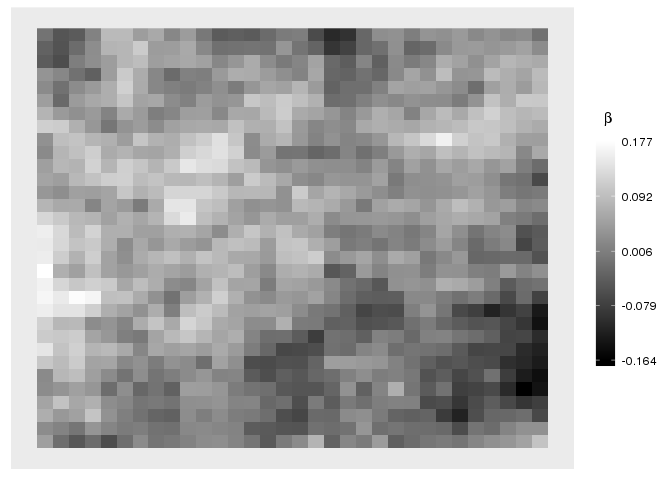

Scalar-on-Image regression using iterative methods
--------------------------------------------------

This package is a wrapper for the Sarim package (also available via github). Note that for Sarim C++11 must be enabled. This can be done in R with:

``` r
# install Sarim:
Sys.setenv("PKG_CXXFLAGS"="-std=c++11")
devtools::install_github("chkue/Sarim")
```

Install SOIR with:

``` r
devtools::install_github("RaphaelRe/SOIR")
```

The SOIR() function can be used within Sarim. This is a short example how to use:

``` r
library(Sarim)
library(SOIR)
library(magrittr)

# generate images (100 images each 32x32, vectorized)
ims <- replicate(100, (1:(32*32))+ rnorm(32*32, sd = 2)) %>% t

# generate true coefficient image
grid <- seq(0,1,len = 32)
beta <- smoothBeta(grid, grid) %>% as.vector()

# generate response
y <- ims  %*% beta + rnorm(100, sd = 5)
mod <- Sarim::sarim(y ~ SOIR(ims, add_diag = 0.1, neighbours = "2dfirst",
                             ka_a = 20, ka_b = 1e-3), nIter = 100)
```

    ## Loading required package: Matrix

``` r
# visualize result (of course has no sense)
get_beta(mod, intercept = FALSE, burnin = 10, reduce = TRUE) %>% 
  set_dim(c(32,32)) %>% 
  plot_coefficient_image
```

    ## Loading required package: ggplot2

    ## Loading required package: checkmate


